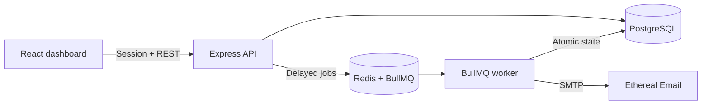

# ReachInbox Email Scheduler

A full-stack, durable email scheduling service built for the ReachInbox software development intern assignment. Users sign in with Google, upload a CSV/text lead list, choose campaign pacing, and monitor scheduled, sent, and failed emails from a React dashboard.

The implementation is original and was written specifically for this assignment.

## Feature coverage

| Requirement | Implementation |
| --- | --- |
| TypeScript + Express | Strict TypeScript API in `backend/src` |
| Relational persistence | PostgreSQL with Prisma migrations |
| Persistent scheduler | BullMQ delayed jobs backed by Redis AOF |
| No cron | No cron library, OS cron, or polling scheduler is used |
| Email delivery | Pooled Nodemailer transport using Ethereal SMTP |
| Restart safety | Redis persistence plus DB-to-queue reconciliation on API startup/Redis reconnect |
| Idempotency | Deterministic job ID, Redis send lock, and atomic DB status claim |
| Worker concurrency | `WORKER_CONCURRENCY` environment setting |
| Minimum delay | Distributed BullMQ limiter using `MIN_SEND_DELAY_MS` (default: 2 seconds) |
| Hourly rate limit | Atomic Redis counter per sender/hour, capped by an environment setting |
| Limit overflow | Jobs move to the next hourly window; they are never dropped |
| Multiple senders | Sender identity is stored per campaign; counters are isolated by sender ID |
| Google login | Real Passport Google OAuth 2.0 flow with Redis-backed sessions |
| Dashboard | Scheduled/Sent tabs, status totals, pagination, loading/empty/error states |
| Compose workflow | Sender, subject, body, CSV/text parsing, start time, delay, hourly limit |
| UX and code quality | Reusable typed components, responsive Tailwind UI, toast feedback |

## Architecture



The API and worker are deliberately separate processes. More worker instances can be started without changing application code because queue claims, send locks, and rate counters live in Redis/DB rather than process memory.

## Scheduling lifecycle

1. The authenticated API validates and de-duplicates up to 5,000 recipients.
2. It writes the sender, campaign, and recipient rows to PostgreSQL in one transaction.
3. Each recipient receives a pre-generated UUID and a calculated `scheduledAt` value: `startAt + position × delayMs`.
4. Jobs are added to BullMQ in batches of 500 with deterministic IDs such as `email-<emailJobId>`.
5. BullMQ stores future work as delayed jobs in Redis. At the due time, a worker claims the job.
6. The worker obtains a Redis lock, reserves an hourly sender slot atomically, and changes the DB row from `SCHEDULED` to `SENDING` with a conditional update.
7. Nodemailer sends through Ethereal. The worker records `SENT`, the SMTP message ID, timestamp, and Ethereal preview URL, or records `FAILED`.

### Restart persistence and DB/queue recovery

- Redis runs with append-only persistence and a Docker volume, so BullMQ delayed jobs survive application/worker restarts.
- PostgreSQL remains the source of truth for campaign and delivery state.
- On API startup and whenever Redis reconnects, `reconcileScheduledEmails()` reads `QUEUED`/`SCHEDULED` DB rows and safely adds them again using the same deterministic BullMQ job IDs. Existing jobs are not duplicated.
- If the DB commit succeeds but Redis is temporarily unavailable, the API returns `202` with `queueState: pending_recovery`. The persisted rows are queued when Redis reconnects or the API restarts.
- A campaign is never recreated “from Day 1”; reconciliation works at the individual unsent-recipient level.

### Idempotency and the SMTP boundary

The system prevents concurrent or normal restart duplicates with three layers:

1. A deterministic BullMQ job ID for every DB email row.
2. A per-email Redis lock shared by all worker instances.
3. An atomic DB claim that succeeds only for `QUEUED`/`SCHEDULED` rows.

After a worker changes a row to `SENDING`, SMTP errors are marked `FAILED` and are not automatically retried. A stable `Message-ID` and `X-ReachInbox-Idempotency-Key` are also sent for tracing. This intentionally chooses **at-most-once SMTP handoff** over duplicate risk.

No SMTP protocol can guarantee true end-to-end exactly-once delivery if a process crashes after the provider accepts a message but before the local DB commit. Ethereal does not expose an idempotent HTTP send key. In a production provider integration, I would pass the same delivery key to a provider that supports idempotency and then safely retry ambiguous requests.

## Concurrency and rate limiting

### Worker concurrency

`WORKER_CONCURRENCY` controls how many jobs one worker can process concurrently (default `10`). Multiple worker processes/containers are also safe. Concurrency helps database/Redis/SMTP I/O overlap, while the distributed limiters control actual send throughput.

### Minimum delay between sends

The worker uses BullMQ’s limiter:

```ts
limiter: { max: 1, duration: MIN_SEND_DELAY_MS }
```

The default `MIN_SEND_DELAY_MS=2000` creates a minimum global two-second interval between sends. BullMQ enforces this in Redis, so it applies across parallel jobs and multiple worker instances—not just within one JavaScript process. Campaign delay values below the system minimum are raised to this value.

### Per-sender hourly limit

Before SMTP handoff, the worker executes one Redis Lua script against:

```text
email-rate:<senderId>:<UTC-hour-start>
```

The script creates/increments the counter only when it is below the effective limit. This compare-and-increment is atomic across all worker instances. The effective limit is:

```text
min(campaign.hourlyLimit, MAX_EMAILS_PER_HOUR_PER_SENDER)
```

This lets the UI choose a lower campaign limit without bypassing the environment safety ceiling. When the limit is full, `job.moveToDelayed()` moves the email to the next hour plus a position-based offset. This keeps campaign order reasonably stable and prevents a new thundering herd at exactly `HH:00`. The DB `scheduledAt` is updated to match. No email is dropped or marked failed due to throttling.

### What happens with 1,000+ emails at the same time?

- PostgreSQL uses one `createMany`, and BullMQ uses batches of 500 rather than 1,000 sequential API calls.
- Redis holds delayed jobs persistently; the API does not keep timers in memory.
- BullMQ distributes due jobs across configured worker concurrency.
- The global minimum-delay limiter smooths immediate sending.
- The atomic per-sender counter allows only the configured hourly quota.
- Excess jobs return to BullMQ’s delayed set for later hour windows. Position offsets preserve order as much as possible.
- Dashboard APIs are paginated, so viewing a large campaign does not return every row at once.

## Project structure

```text
reachinbox-email-scheduler/
├── backend/
│   ├── prisma/                 # PostgreSQL schema and migration
│   ├── src/
│   │   ├── auth/               # Google OAuth strategy
│   │   ├── config/             # Validated environment and logger
│   │   ├── middleware/         # Authentication and error handling
│   │   ├── queue/              # BullMQ queue and reconciliation
│   │   ├── routes/             # Auth, campaign, and email APIs
│   │   ├── services/           # SMTP, Redis limiter, distributed lock
│   │   ├── app.ts              # Express composition
│   │   ├── server.ts           # API process
│   │   └── worker.ts           # Worker process
│   └── tests/
├── frontend/
│   └── src/
│       ├── components/         # Reusable modal, table, fields, status UI
│       ├── hooks/              # Auth and email data hooks
│       ├── lib/                # Typed API client and lead parser
│       ├── pages/              # Login and dashboard
│       └── types/              # API contracts
├── docker-compose.yml
├── .env.example
├── sample-leads.csv
└── DEMO_SCRIPT.md
```

## Local setup

### Prerequisites

- Node.js 20+
- Docker Desktop (recommended for PostgreSQL and Redis)
- A Google Cloud OAuth web client
- An Ethereal Email test account

### 1. Install and configure

```bash
npm install
cp .env.example .env
```

Generate a strong session secret, for example:

```bash
openssl rand -base64 48
```

Put it in `SESSION_SECRET` in `.env`.

### 2. Start PostgreSQL and Redis

```bash
docker compose up -d postgres redis
```

The Redis container enables AOF and both services use named volumes.

### 3. Create the database schema

```bash
npm run db:generate
npm run db:migrate -- --name init
```

The initial SQL migration is included, so reviewers can alternatively run:

```bash
npm run db:deploy -w backend
```

### 4. Configure real Google OAuth

In [Google Cloud Console](https://console.cloud.google.com/apis/credentials):

1. Configure the OAuth consent screen.
2. Create credentials → **OAuth client ID** → **Web application**.
3. Add authorized JavaScript origin: `http://localhost:5173`.
4. Add authorized redirect URI: `http://localhost:4000/auth/google/callback`.
5. Copy the client ID and secret into `.env`.

The app uses a server-side OAuth callback and a Redis-backed, HTTP-only session cookie. There is no mock login.

### 5. Configure Ethereal

Create a disposable Ethereal account:

```bash
npm run ethereal:create
```

Copy the printed SMTP values into `.env`. Messages are captured by Ethereal and are never delivered to real recipients. After a successful send, the Sent Emails table exposes an Ethereal **Preview** link.

### 6. Run the application

```bash
npm run dev
```

- Frontend: `http://localhost:5173`
- API: `http://localhost:4000`
- The root dev script starts API, worker, and frontend together.

To run processes independently:

```bash
npm run dev -w backend
npm run dev:worker -w backend
npm run dev -w frontend
```

### Full Docker run

After `.env` contains OAuth, session, and Ethereal values:

```bash
docker compose up --build
```

Compose builds frontend/API images, applies Prisma migrations in the API container, starts a separate worker, and exposes the same localhost URLs.

## Environment variables

| Variable | Default/example | Purpose |
| --- | --- | --- |
| `PORT` | `4000` | Express port |
| `FRONTEND_URL` | `http://localhost:5173` | CORS and OAuth redirect destination |
| `DATABASE_URL` | PostgreSQL URL | Prisma connection |
| `REDIS_URL` | `redis://localhost:6379` | BullMQ, limits, locks, and sessions |
| `GOOGLE_CLIENT_ID` | required | Real OAuth client |
| `GOOGLE_CLIENT_SECRET` | required | Real OAuth secret |
| `GOOGLE_CALLBACK_URL` | local callback | Must match Google Console exactly |
| `SESSION_SECRET` | required, 32+ chars | Signs session cookies |
| `SMTP_HOST/PORT/SECURE` | Ethereal values | SMTP connection |
| `SMTP_USER/SMTP_PASS` | required | Ethereal credentials |
| `WORKER_CONCURRENCY` | `10` | Parallel jobs per worker |
| `MIN_SEND_DELAY_MS` | `2000` | Distributed minimum send interval |
| `MAX_EMAILS_PER_HOUR_PER_SENDER` | `200` | System ceiling per sender/hour |
| `SEND_LOCK_TTL_MS` | `300000` | Distributed email claim lock TTL |
| `VITE_API_URL` | `http://localhost:4000` | Browser API base URL |

## API summary

All `/api/*` routes require a valid Google-backed session.

| Method | Route | Purpose |
| --- | --- | --- |
| `GET` | `/auth/google` | Start Google OAuth |
| `GET` | `/auth/google/callback` | OAuth callback |
| `GET` | `/auth/me` | Current user name/email/avatar |
| `POST` | `/auth/logout` | Destroy Redis session |
| `POST` | `/api/campaigns` | Persist and schedule one campaign |
| `GET` | `/api/emails?view=scheduled&page=1` | Paginated queued/scheduled/sending emails |
| `GET` | `/api/emails?view=sent&page=1` | Paginated sent/failed emails |
| `GET` | `/api/emails/stats` | Dashboard totals |
| `GET` | `/api/config` | Active limits for the frontend |
| `GET` | `/health` | Process health |

Example schedule body:

```json
{
  "senderEmail": "sender@example.com",
  "senderName": "Sathvik",
  "subject": "A quick idea for your team",
  "body": "Hi,\n\nI wanted to share a quick idea.",
  "recipients": ["lead1@example.com", "lead2@example.com"],
  "startAt": "2026-08-20T12:30:00.000Z",
  "delayMs": 2000,
  "hourlyLimit": 200
}
```

## Validation

```bash
npm run build
npm test
```

Tests cover CSV/text email de-duplication and the distributed hourly-limit contract. Recommended manual validation:

1. Schedule three future emails.
2. Stop API and worker, but keep DB/Redis running.
3. Restart them before the due time.
4. Confirm the same DB rows send once and appear in Sent Emails.
5. Set the campaign limit to `2` and confirm the third job moves to the next hour.

## Assumptions and trade-offs

- One authenticated user is treated as one tenant; senders belong to that user.
- The campaign body is plain text. Personalization tokens are displayed but not expanded because lead files are required only to provide email addresses.
- Fixed UTC hourly windows are simpler to explain and operate than a rolling-window limiter. They can permit a burst around an hour boundary; the separate two-second limiter still smooths sends.
- Position-based rescheduling preserves campaign order approximately, not as a strict total order across different campaigns for the same sender.
- Redis and PostgreSQL must use persistent production storage. Deleting Docker volumes intentionally deletes scheduler state.
- Automatic SMTP retries are disabled after a delivery claim to prioritize the hard “no duplicate sends” requirement. Failed rows are visible for deliberate operator action.
- Google OAuth configuration and Ethereal credentials are deployment-specific and therefore are not committed.

## Demo and submission

Use [DEMO_SCRIPT.md](./DEMO_SCRIPT.md) for a five-minute recording that covers scheduling, dashboard status, restart persistence, and rate limiting.

Before submission:

- Create a **private** GitHub repository and push this project.
- Add GitHub collaborators `Mitrajit` and `Yadav036` (verify the exact usernames supplied by ReachInbox).
- Add the repository and demo-video links to the assignment form.
- Keep `.env` untracked and verify no credentials appear in terminal/video history.
- Record one clean restart demonstration with future emails still pending.

